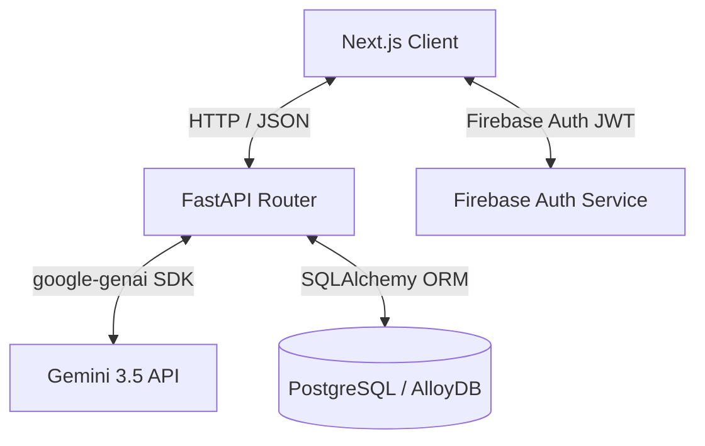

# Smart Bharat - Technical Codebase Map

This map acts as the primary memory bank for agentic operations, maintaining consistency across full-stack component modifications and preventing logic regressions.

---

## 🗺️ Architectural Data Flow

---

## 📌 Route & Endpoint Matrix

| Method | Endpoint | Source File | Description | Output Schema |
|---|---|---|---|---|
| `POST` | `/api/chat` | `backend/app/main.py` | Streaming/Static Gemini chat response | `{ response: string }` |
| `POST` | `/api/complaints` | `backend/app/main.py` | Create a new civic complaint | Complaint Object |
| `GET` | `/api/complaints/{id}` | `backend/app/main.py` | Get timeline of a single complaint | `{ id, status, timeline: [] }` |
| `GET` | `/api/services` | `backend/app/main.py` | Get Central/State schemes list | List of Service Objects |
| `POST` | `/api/profile` | `backend/app/main.py` | Store preferred languages/demographics | Citizen Profile |

---

## 🛡️ Zombie Code Guard (Do Not Create/Use)
*   Do not create duplicate mock database connector files. All DB operations must use `backend/app/database.py`.
*   Avoid adding local JSON translations directly inside React components. Use translation dictionary keys in `frontend/src/i18n/*` locales.

---

## ⚓ Status Badges Matrix
Complaints must progress through these states in order:
`Submitted` ➡️ `In Progress` ➡️ `Resolved`
